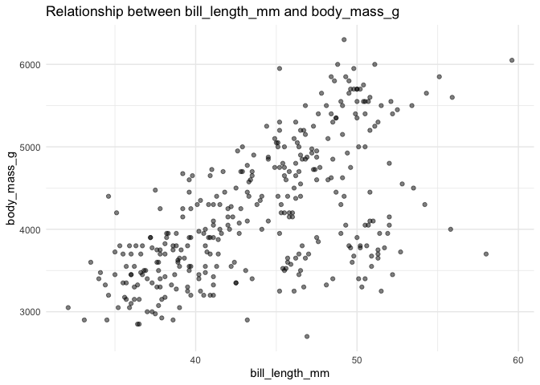
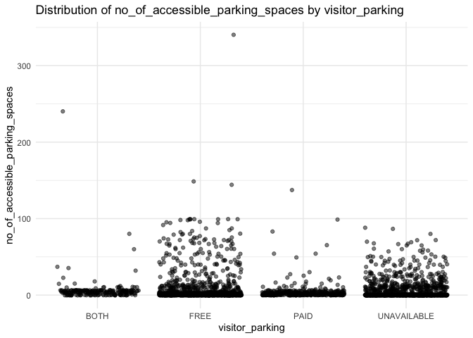

Assignment-B1
================
Rui Guo

### Load Libraries

``` r
library(tidyr)
library(ggplot2)
library(dplyr)
library(datateachr)
library(palmerpenguins)
library(testthat)
```

## Exercise 1 & 2

From the mda project, I made some plots depending on the types of the
independent and dependent variables. Every time I need to rewrite the
ggplot function to get the plots, so I create this function in order to
reduce repeating work for plotting.

To be specific, if I want to see the distribution of two numeric
variables, I can just input the names of two numeric variables as
arguments to get a scatter plot from my function. While, if I want to
check the relationship between a categorical independent variable and a
numeric dependent variable, I can input the names of the categorical
variable and the numeric variable as arguments to get a jitter plot from
my function.

**Notice:**

- This function only works in **two situations**:
  - the two variables are both numeric.
  - the independent variable is categorical and the dependent variable
    is numeric.
- Before generating plots, **the missing values in the variables will be
  removed**. For example, a ‘NA’ category isn’t included in the jitter
  plot.

``` r
#' @title my_plot
#' @description This function produces jitter plots for categorical independent variables & numeric dependent variables, and scatter plots for numeric independent & dependent variables.
#' @param data The dataset we will use, which can be data.frame or tibble. The naming is straightforward.
#' @param independent_var The independent variable, which can be categorical or numeric. The naming is straightforward.
#' @param dependent_var The dependent variable, which can only be numeric. The naming is straightforward.
#' @param a The alpha transparency that can be customized. Naming it after the initial of "alpha".
#' @return A plot (ggplot object) reflecting the relationship or distirbution between the two variables, it can be jitter plot or scatter plot.
my_plot <- function(data, independent_var, dependent_var, a) {
  # Check dataset form
  if (!is.data.frame(data)) {
    stop("data should be a data.frame or a tibble")
  }
  # Check the existence of independent variable
  if (!(independent_var %in% names(data))) {
    stop(paste("independent variable", independent_var, "is not in the dataset"))
  }
  # Check the existence of dependent variable
  if (!(dependent_var %in% names(data))) {
    stop(paste("dependent variable", dependent_var, "is not in the dataset"))
  }
  # Remove missing values
  plot_data <- data %>%
    select(all_of(c(independent_var, dependent_var))) %>%
    drop_na()
  # Check whether dependent variable is numeric
  if (!is.numeric(plot_data[[dependent_var]])) {
    stop("dependent variable is not numeric")
  }
  # For categorical independent variables
  if (is.character(plot_data[[independent_var]]) || is.factor(plot_data[[independent_var]])) {
    # Jitter plot for categorical and numeric
    p <- ggplot(plot_data, aes(x = .data[[independent_var]], y = .data[[dependent_var]])) +
      geom_jitter(alpha = a) +
      labs(
        title = paste("Distribution of", dependent_var, "by", independent_var),
        x = independent_var,
        y = dependent_var
      ) +
      theme_minimal()
  }
  # For numeric independent variables
  else if (is.numeric(plot_data[[independent_var]])) {
    # Scatter plot for both numeric
    p <- ggplot(plot_data, aes(x = .data[[independent_var]], y = .data[[dependent_var]])) +
      geom_point(alpha = a) +
      labs(
        title = paste("Relationship between", independent_var, "and", dependent_var),
        x = independent_var,
        y = dependent_var
      ) +
      theme_minimal()
  } else {
    stop("this function only accpets：
1. independent variable is categorical and dependent variable is numeric
2. both variables are numeric")
  }
  return(p)
}
```

## Exercise 3

### Example 1: Both variables are numeric

The data used here is the “penguins” dataset from “palmerpenguins”.
First, have a look at the content of the dataset.

``` r
print(penguins)
```

    ## # A tibble: 344 × 8
    ##    species island    bill_length_mm bill_depth_mm flipper_length_mm body_mass_g
    ##    <fct>   <fct>              <dbl>         <dbl>             <int>       <int>
    ##  1 Adelie  Torgersen           39.1          18.7               181        3750
    ##  2 Adelie  Torgersen           39.5          17.4               186        3800
    ##  3 Adelie  Torgersen           40.3          18                 195        3250
    ##  4 Adelie  Torgersen           NA            NA                  NA          NA
    ##  5 Adelie  Torgersen           36.7          19.3               193        3450
    ##  6 Adelie  Torgersen           39.3          20.6               190        3650
    ##  7 Adelie  Torgersen           38.9          17.8               181        3625
    ##  8 Adelie  Torgersen           39.2          19.6               195        4675
    ##  9 Adelie  Torgersen           34.1          18.1               193        3475
    ## 10 Adelie  Torgersen           42            20.2               190        4250
    ## # ℹ 334 more rows
    ## # ℹ 2 more variables: sex <fct>, year <int>

Choose the numeric independent variable “bill_length_mm” and the numeric
dependent variable “body_mass_g”, then draw a scatter plot for them.

``` r
my_plot(penguins, "bill_length_mm", "body_mass_g", 0.5)
```

<!-- -->

### Example 2: Independent variables are categorical while dependent variables are numeric

The data used here is the “apt_buildings” dataset from “datateachr”.
First, have a look at the content of the dataset.

``` r
print(apt_buildings)
```

    ## # A tibble: 3,455 × 37
    ##       id air_conditioning amenities             balconies barrier_free_accessi…¹
    ##    <dbl> <chr>            <chr>                 <chr>     <chr>                 
    ##  1 10359 NONE             Outdoor rec faciliti… YES       YES                   
    ##  2 10360 NONE             Outdoor pool          YES       NO                    
    ##  3 10361 NONE             <NA>                  YES       NO                    
    ##  4 10362 NONE             <NA>                  YES       YES                   
    ##  5 10363 NONE             <NA>                  NO        NO                    
    ##  6 10364 NONE             <NA>                  NO        NO                    
    ##  7 10365 NONE             <NA>                  NO        YES                   
    ##  8 10366 CENTRAL AIR      Indoor pool , Indoor… YES       NO                    
    ##  9 10367 NONE             <NA>                  YES       YES                   
    ## 10 10368 NONE             Indoor recreation ro… YES       YES                   
    ## # ℹ 3,445 more rows
    ## # ℹ abbreviated name: ¹​barrier_free_accessibilty_entr
    ## # ℹ 32 more variables: bike_parking <chr>, exterior_fire_escape <chr>,
    ## #   fire_alarm <chr>, garbage_chutes <chr>, heating_type <chr>, intercom <chr>,
    ## #   laundry_room <chr>, locker_or_storage_room <chr>, no_of_elevators <dbl>,
    ## #   parking_type <chr>, pets_allowed <chr>, prop_management_company_name <chr>,
    ## #   property_type <chr>, rsn <dbl>, separate_gas_meters <chr>, …

Choose the categorical independent variable “visitor_parking” and the
numeric dependent variable “no_of_accessible_parking_spaces”, then draw
a jitter plot for them.

``` r
my_plot(apt_buildings, "visitor_parking", "no_of_accessible_parking_spaces", 0.3)
```

<!-- -->

### Exercise 4

What I want to test is about the input of the function and the
properties of the output plots.

#### Test 1: Check the return type of the function

``` r
test_that("Function returns ggplot object", {
  generated_plot <- my_plot(penguins, "species", "flipper_length_mm", 0.5)
  expect_is(generated_plot, "ggplot")
})
```

    ## Test passed 🥇

#### Test 2: Check the existance of input variables

``` r
test_that("The input variable doesn't exist in the dataset", {
  expect_error(my_plot(penguins, "abc", "flipper_length_mm", 0.5), "independent variable abc is not in the dataset")
})
```

    ## Test passed 🥳

#### Test 3: Check the class of input variables

``` r
test_that("The type of input variable is not accepted", {
  expect_error(my_plot(apt_buildings, "no_of_units", "window_type", 0.5), "dependent variable is not numeric")
})
```

    ## Test passed 😀

#### Test 4: Check if the missing values in variables are removed before plotting

``` r
test_that("The missing values are removed", {
  generated_plot <- my_plot(penguins, "species", "flipper_length_mm", 0.5)
  expected_data <- penguins %>%
    select(species, flipper_length_mm) %>%
    drop_na()
  expect_equal(generated_plot$data, expected_data)
})
```

    ## Test passed 🥳

#### Test 5: Check the properties of the layers of the plot

``` r
test_that("The plot has only one layer and the layer uses point geometry", {
  generated_plot <- my_plot(penguins, "island", "body_mass_g", 0.5)
  expect_equal(length(generated_plot$layers), 1)
  expect_true(inherits(generated_plot$layers[[1]]$geom, "GeomPoint"))
})
```

    ## Test passed 😸

#### Test 6: Check if the alpha transparency of the plot is euqal to the input argument ‘a’

``` r
test_that("The transparency is equal", {
  generated_plot <- my_plot(penguins, "species", "body_mass_g", 0.7)
  expect_equal(generated_plot$layers[[1]]$aes_params$alpha, 0.7)
})
```

    ## Test passed 🥳
